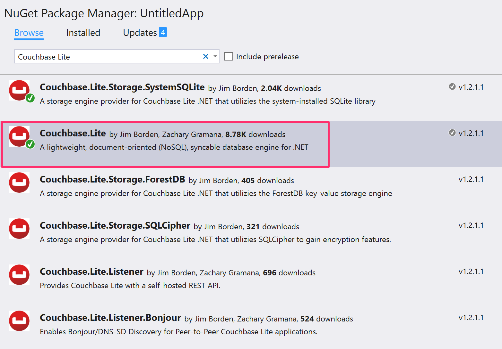
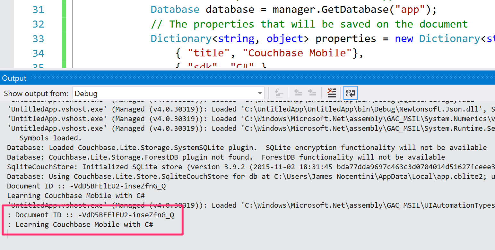

# Creating a new project

Install Couchbase Lite in your Visual Studio project for .NET applications (WPF, Windows Service).

1. In **Solution Explorer**, right-click on your project and click **Select NuGet Packages...**.
    
2. Search for 'Couchbase Lite' and select the latest version of Couchbase Lite.
    

Once the Couchbase Lite NuGet package is installed you should see that Couchbase.Lite.Storage.SystemSQLite is also installed. That's because SQLite is the default storage type used by Couchbase Lite. You can install additional components as required by the application.

That's it! You can now start using Couchbase Lite in your application.

**Note**: UWP & Windows Phone isn't supported at this time.

## Get Started

Open `MainWindow.xaml.cs` in Visual Studio and add the following in the `MainWindow` method.

```c#
// Create a manager
Manager manager = Manager.SharedInstance;
// Create or open the database named app
Database database = manager.GetDatabase("app");
// The properties that will be saved on the document
Dictionary<string, object> properties = new Dictionary<string, object> {
    { "title", "Couchbase Mobile"},
    { "sdk", "C#" }
};
// Create a new document
Document document = database.CreateDocument();
// Save the document to the database
document.PutProperties(properties);
// Log the document ID (generated by the database)
// and properties
Debug.WriteLine($"Document ID :: {document.Id}");
Debug.WriteLine($"Learning {document.GetProperty("title")} with {document.GetProperty("sdk")}");
```

Click the **Start** button. Notice the document ID and properties are logged to the console.
