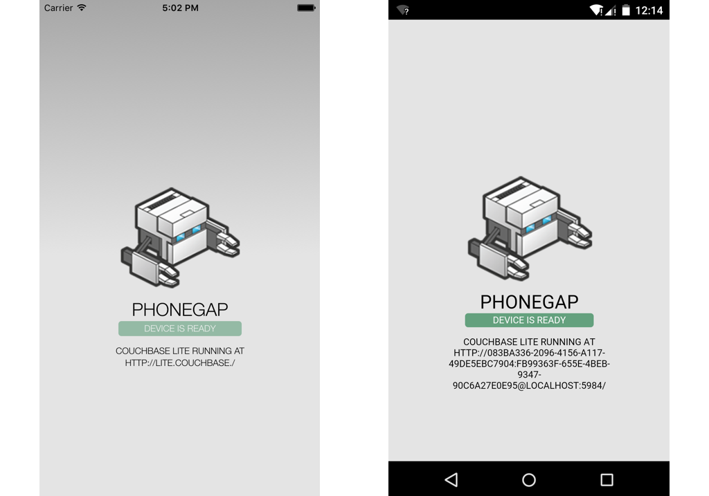

# Creating a new project

Install Couchbase Lite in your PhoneGap project. The following guide shows you how to include the Couchbase Lite PhoneGap plugin.

## PhoneGap Plugin

You will install Couchbase Lite using the PhoneGap CLI module.
```
npm install -g phonegap
phonegap create UntitledApp
cd UntitledApp/
phonegap local plugin add https://github.com/couchbaselabs/Couchbase-Lite-PhoneGap-Plugin.git
```
On iOS, you must have the **ios-sim** module installed globally to start the emulator from the command line.
```
npm install -g ios-sim
phonegap run ios
```

## Getting Started

Open **www/js/index.js** and add the following in the `onDeviceReady` lifecycle method.
```js
app.receivedEvent('deviceready');
if (window.cblite) {
  window.cblite.getURL(function (err, url) {
    if (err) {
      app.logMessage("error launching Couchbase Lite: " + err)
    } else {
      app.logMessage("Couchbase Lite running at " + url);
    }
  });
} else {
  app.logMessage("error, Couchbase Lite plugin not found.")
}
```
Below the `onDeviceReady` method, add a new method called `logMessage`.
```
logMessage: function(message) {
  var p = document.createElement("p");
  p.innerHTML = message;
  document.body.getElementsByClassName('app')[0].appendChild(p);
  console.log(message);
},
```
Build & run.
```
phonegap run ios
phonegap run android
```
The Couchbase Lite endpoint is displayed on the screen and you can start making RESTful queries to it using the HTTP library of your choice.

