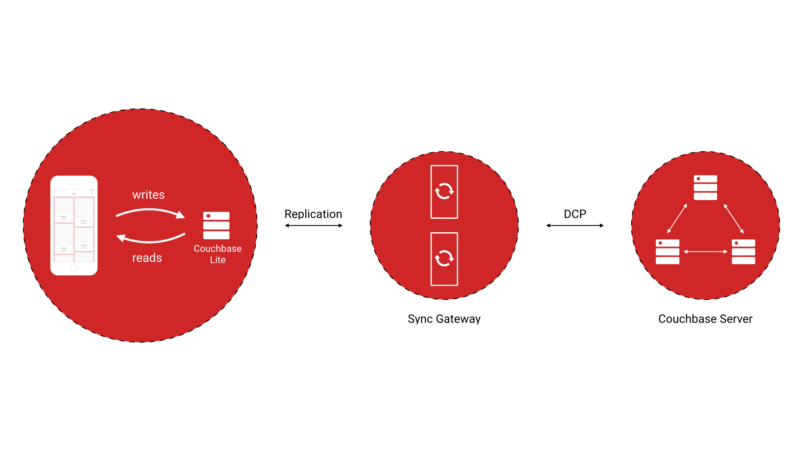
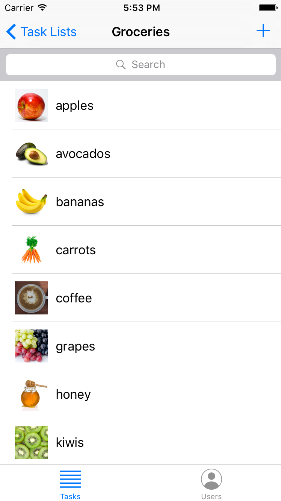

- [Introduction](#introduction)
    - [Course Outline](#course-outline)
    - [A Quick Note About Data Modeling](#a-quick-note-about-data-modeling)

[EDIT ON GITHUB](https://github.com/couchbaselabs/couchbase-mobile-portal/pull/371)

# Introduction

Couchbase Mobile brings the power of NoSQL to mobile. It is comprised of three different components: Couchbase Lite, an embedded NoSQL database, Sync Gateway, an internet-facing synchronization mechanism that securely syncs data between device and cloud, and Couchbase Server, a highly scalable and performant NoSQL database in the cloud. 

Couchbase Mobile simplifies “offline first” development. As shown on the diagram below, Couchbase Lite runs locally on the device and persists data as JSON and binary format. You can perform CRUD operations directly to the local database.

Sync Gateway is the web tier that exposes a database API for Couchbase Lite databases to replicate to and from  Couchbase Server (data is not persisted in Sync Gateway). Couchbase Server is used as a storage engine by Sync Gateway.

In this developer tutorial series, you will build a ToDo List application with Couchbase Mobile and learn how to use the database, add synchronization, and add security.

## Course Outline

### Using the Database

How to use the persistence APIs and query language for simple queries and data aggregation to perform query operations across different model types.

- Querying Data
- Writing Data
- Aggregating Data

### Adding Synchronization

How to install Sync Gateway on your development environment, start the synchronization from the application and manage conflicts.

- Installation
- Synchronizing
- Detecting and resolving Conflicts

### Adding Security

How to add access control rules based on each authenticated user and how to add  security locally with database encryption and offline login.

- User Authentication
- Read/Write Access Controls
- Database Encryption
- Offline Login

### A Quick Note About Data Modeling

Couchbase Mobile is a schemaless database which means there are no restrictions on the database schema. It brings great flexibility during development because it removes the need to run database migrations every time the schema changes. Nonetheless, the application logic will expect particular data structures to be displayed on the screen. Below is the data model for this application. There are 4 document **types**: task-list, moderator, task, task-list:user.

